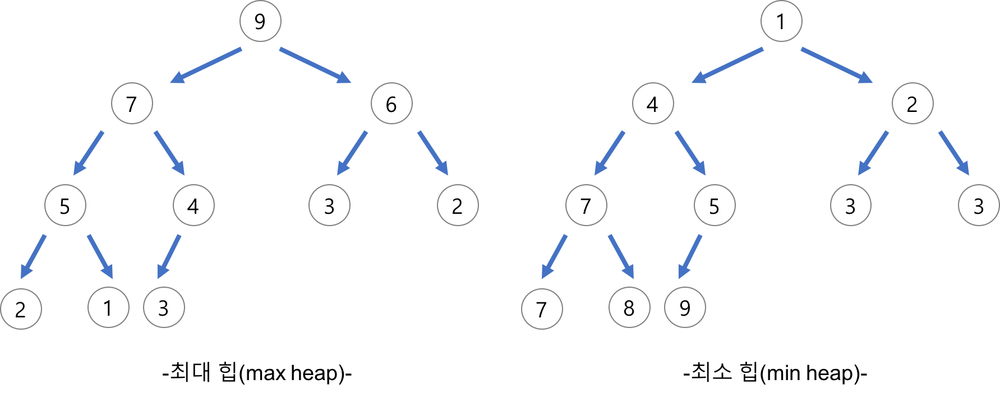

# 힙 정렬 알고리즘

힙 정렬 알고리즘은 완전 이진 트리의 일종으로 우선순위 큐를 위해 만들어진 자료구조다. 힙은 최대 최솟값을 쉽게 찾을 수 있다.


다음 그림과 같이내림차순 정렬을 위해서는 최대 힙을 구성하고 오름차순 정렬을 위해서는 최소 힙을 구성한다.

1. index순으로 새로운 노드를 삽입한다.
2. 삽입한 상태에서 형제노드와 부모노드 값을 비교한다.
3. 비교한 값보다 자신이 더 크다면 자신의 위치와 비교한 노드의 값을 바꾸며 정렬한다.

# 벡터

vector를 생성하면 메모리 heap에 생성되며 동적할당된다.
물론 속도적인 측면에서 배열에 비해 성능은 떨어지지만 메모리를 효율적으로 관리하고 예외처리가 쉽다는 장점이 있어 많이들 사용한다.

```cpp
vector<int>v(4);
```

그럼 c++에서 사용되는 벡터의 이터레이터를 알아보자.
|이터레이터|설명|
|-|-|
| v.begin()| 백터 시작점의 주소 값 반환|
| v.end()| 백터 (끝부분 + 1) 주소값 반환|
| v.rbegin() (revers begin) | 백터의 끝 지점을 시작점으로 반환 |
| v.rend() (revers end)| 백터의 (시작 + 1) 지점을 끝 부분으로 반환 |

# 덱

덱은 우리가 알고있는 큐와 스택을 합친 녀석이다. FIFO와 LIFO둘 다 가능하다.
